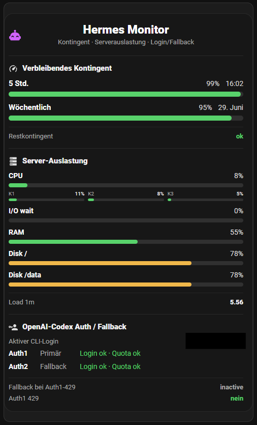

# Hermes Home Assistant Monitor

Dark Home Assistant Lovelace card + Python collector for monitoring a Hermes/Codex host.



The screenshot shows the default dark Lovelace card with remaining Codex quota, server utilization, per-core CPU bars, and Auth1/Auth2 fallback status. Sensitive account data is redacted.

## Architecture

```text
Hermes/Codex host -> MQTT broker -> Home Assistant MQTT integration -> sensor.hermes_live_* -> Lovelace card
```

No Home Assistant long-lived token is required for the normal path. The collector publishes retained MQTT Discovery configs and one retained JSON state topic directly to the broker.

## What it shows

- OpenAI Codex remaining quota (5h + weekly windows)
- Codex CLI account/auth pool state and fallback status
- Host CPU/RAM/disk/load/uptime
- CPU pressure including iowait
- I/O wait as separate row
- Per-core CPU mini bars
- MQTT Discovery live sensors (`sensor.hermes_live_*`)

## Repository layout

```text
server/hermes_ha_monitor.py          # collector / MQTT publisher
systemd/hermes-ha-monitor.service    # oneshot service
systemd/hermes-ha-monitor.timer      # ~2s timer
homeassistant/hermes-monitor-card.yaml
homeassistant/hermes-monitor-card.json
docs/assets/hermes-monitor-dashboard.png
.env.example
```

## Requirements

- Linux host running Hermes/Codex CLI
- Home Assistant with:
  - MQTT integration connected to the same broker
  - `custom:button-card` installed
- Python 3.11+
- MQTT broker credentials

No third-party Python package is required; the collector uses a tiny built-in MQTT 3.1.1 publisher over Python stdlib sockets.

## Install

```bash
sudo mkdir -p /opt/hermes-ha-monitor /var/lib/hermes-ha-monitor
sudo cp server/hermes_ha_monitor.py /opt/hermes-ha-monitor/hermes_ha_monitor.py
sudo chmod +x /opt/hermes-ha-monitor/hermes_ha_monitor.py
sudo cp .env.example /etc/hermes-ha-monitor.env
sudo chmod 600 /etc/hermes-ha-monitor.env
sudo editor /etc/hermes-ha-monitor.env
sudo cp systemd/hermes-ha-monitor.* /etc/systemd/system/
sudo systemctl daemon-reload
sudo systemctl enable --now hermes-ha-monitor.timer
```

Minimal `/etc/hermes-ha-monitor.env`:

```env
MQTT_HOST=mqtt-broker.local
MQTT_PORT=1883
MQTT_USERNAME=hermes
MQTT_PASSWORD=CHANGEME
MQTT_TOPIC_PREFIX=hermes/monitor
```

## MQTT topics

- State topic: `hermes/monitor/state`
- Discovery topics: `homeassistant/sensor/hermes_live_*/config`

The state topic is one retained JSON object keyed by source entity id, e.g. `sensor.hermes_host_cpu_usage`. MQTT Discovery maps those into Home Assistant entities named `sensor.hermes_live_*`.

## Home Assistant card

Add `homeassistant/hermes-monitor-card.yaml` as a manual Lovelace card. The card expects the MQTT live entities created by the collector, e.g.:

- `sensor.hermes_live_openai_codex_5h_remaining`
- `sensor.hermes_live_host_cpu_usage`
- `sensor.hermes_live_host_cpu_core_0_usage`
- `sensor.hermes_live_host_iowait_usage`

First collector run publishes MQTT discovery. If counters are new, the first run seeds CPU deltas; the second run produces CPU/per-core values.

## Refresh rate

Default systemd timer:

```ini
OnUnitActiveSec=2s
AccuracySec=1s
```

So data push is roughly every 2 seconds. Lovelace re-render depends on HA/browser WebSocket updates.

## Security / privacy

Do not commit real MQTT passwords, Home Assistant tokens/URLs, account emails, auth JSON files, or state files. This repo includes only templates and code. The collector reads secrets from `/etc/hermes-ha-monitor.env` or environment variables.

## Legacy Home Assistant REST mode

If `HOMEASSISTANT_URL` and `HOMEASSISTANT_TOKEN` are set, the collector can additionally post REST state updates to Home Assistant. Normal recommended mode is direct MQTT only.
